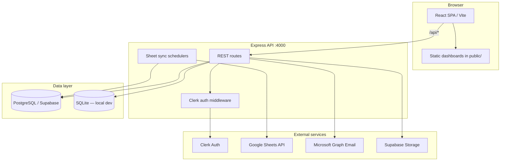

# Frido Master Dashboard

> Internal operations hub for Frido — a single authenticated portal for analytics, retail tooling, feedback workflows, ISD dashboards, notices, and admin.

[](https://nodejs.org/)
[](https://react.dev/)
[](https://expressjs.com/)
[](#license)

---

## Table of Contents

- [Overview](#overview)
- [Architecture](#architecture)
- [Tech Stack](#tech-stack)
- [Project Structure](#project-structure)
- [Features & Modules](#features--modules)
- [Data Pipelines](#data-pipelines)
- [Database](#database)
- [Authentication & Permissions](#authentication--permissions)
- [Getting Started](#getting-started)
- [Environment Variables](#environment-variables)
- [Scripts](#scripts)
- [Testing](#testing)
- [Deployment](#deployment)
- [Troubleshooting](#troubleshooting)
- [License](#license)

---

## Overview

Frido Master Dashboard consolidates day-to-day tools that were previously scattered across Google Sheets, external URLs, and standalone HTML dashboards. Users sign in via **Clerk**; access is controlled by **role-based permissions** defined in `src/config/permissions.js`.

| Area | What it provides |
|------|------------------|
| **Analytics** | Business analytics links, ISD performance dashboards, manpower attendance, ORM |
| **Retail** | Staff portal, store analytics console, retail admin shortcuts |
| **Feedback** | Product feedback, AI calling feedback, retail feedback views |
| **Operations** | Order dispute tracking, notices, HR policy documents |
| **Admin** | User invites, role management, dashboard link configuration |

The app ships as a **PWA** (installable, offline-capable shell) with dark/light theme support.

---

## Architecture



| Environment | Behavior |
|-------------|----------|
| **Production** | Express serves the built Vite bundle from `dist/` and handles all `/api/*` routes on one Render web service. Postgres is hosted on Supabase via `DATABASE_URL`. |
| **Local dev** | Vite dev server on port **3005** proxies `/api` to Express on port **4000**. SQLite is used when `DATABASE_URL` is unset. |

---

## Tech Stack

| Layer | Technology |
|-------|------------|
| Frontend | React 19, React Router 7, Vite 7 |
| Styling | Plain CSS (design tokens in `src/index.css`, page-level CSS) |
| Auth | Clerk (`@clerk/react`, `@clerk/express`) |
| API | Express 5 |
| Database | PostgreSQL via Supabase (prod) · SQLite via `better-sqlite3` (local) |
| File storage | Supabase Storage (notices, HR policy PDFs) · local disk fallback |
| Email | Microsoft Graph API |
| Sheets sync | Google Sheets API (`googleapis`) |
| Testing | Vitest, Testing Library |
| CI/CD | GitHub Actions → Render deploy hook |
| PWA | `vite-plugin-pwa` + Workbox |

---

## Project Structure

```
Frido-Master-Dashboard/
├── public/                      # Static assets served as-is
│   ├── exec-dashboard/          # Standalone HTML dashboards (published CSV / local)
│   ├── fes-sm-dashboard/
│   ├── ist-console/
│   ├── orm-dashboard/
│   ├── retail-feedback/
│   └── salary-analysis/
│
├── src/                         # React frontend
│   ├── App.jsx                  # Route definitions + RoleGuard wrappers
│   ├── main.jsx                 # ClerkProvider bootstrap
│   ├── index.css                # Global design tokens
│   ├── components/              # Reusable UI (Layout, AuthGate, RoleGuard, …)
│   ├── context/                 # AuthContext, ThemeContext, DashboardDataContext
│   ├── config/
│   │   ├── permissions.js       # RBAC — roles, route access, sidebar visibility
│   │   ├── dashboardData.js     # Business analytics link categories
│   │   └── feedbackDatabase.js  # Feedback product catalog config
│   ├── pages/                   # Route-level page components
│   └── utils/                   # Client-side helpers
│
├── server/                      # Express API
│   ├── index.js                 # App entry, middleware, schedulers
│   ├── db.js                    # Postgres/SQLite adapter + migrations
│   ├── schema/
│   │   └── pgStatements.js      # DDL for all tables (auto-applied on boot)
│   ├── routes/                  # API route handlers
│   ├── services/                # Business logic + external integrations
│   ├── middleware/              # auth.js, noticeUpload.js
│   ├── utils/                   # Shared server helpers
│   ├── constants/               # Static config (sheet IDs, document paths)
│   └── scripts/                 # One-off CLI: seed, migrate, upload PDFs
│
├── .github/workflows/           # CI (lint, test, build) + CD (Render hook)
├── render.yaml                  # Render Blueprint
├── vite.config.js               # Vite + PWA + API proxy
└── package.json
```

---

## Features & Modules

### Frontend pages (`src/pages/`)

| Route | Page | Access |
|-------|------|--------|
| `/` | Home redirect (role-based default) | Authenticated |
| `/admin` | User management, invites, imports | Admin |
| `/profile` | User profile | All roles |
| `/business-analytics` | Link hub — Shopify, stores, tooling | Admin, Data Analyst |
| `/retail-staff` | Retail staff portal | Admin, Staff |
| `/retail-staff/analytics-console` | Store analytics console | Admin, Staff |
| `/retail-admin` | Retail admin shortcuts | Admin |
| `/isd-nm` | ISD NM staff hub | Admin, Executive, Team Lead |
| `/isd/executive-performance` | Executive performance dashboard | Email allowlist |
| `/isd/performance-profitability` | Profitability dashboard | Email allowlist |
| `/isd/salary-analysis` | Salary analysis | Email allowlist |
| `/manpower` | Attendance grid + leaderboard | Admin, Team Lead |
| `/feedback-department` | Product feedback dashboard | Admin, Feedback, Data Analyst |
| `/ai-calling-feedback` | AI calling feedback | Admin, Feedback, Data Analyst |
| `/retail-feedback` | Retail feedback dashboard | Admin, Feedback, Data Analyst |
| `/order-dispute` | Order dispute tracker | Admin |
| `/orm` | Online reputation management | Admin, Data Analyst, ORM Lead |
| `/lms-dashboard` | LMS dashboard embed | Admin |

External links (Google Sheets, third-party tools) are also gated by role — see `routePermissions` in `src/config/permissions.js`.

### Static dashboards (`public/`)

Self-contained HTML dashboards bundled with the app. These load published Google Sheet CSV data directly in the browser and do not use the Express API:

| Directory | Purpose |
|-----------|---------|
| `exec-dashboard/` | Executive performance |
| `fes-sm-dashboard/` | FES social media |
| `ist-console/` | IST console |
| `orm-dashboard/` | ORM metrics |
| `retail-feedback/` | Retail feedback |
| `salary-analysis/` | Salary analysis |

### API routes (`/api/*`)

| Prefix | Purpose |
|--------|---------|
| `/api/auth` | Auth helpers, session sync |
| `/api/users` | User CRUD, invites, bulk import |
| `/api/notices` | Notice board + acknowledgements + attachments |
| `/api/dashboards` | Configurable dashboard link sections (DB-backed) |
| `/api/feedback/products` | Feedback product catalog |
| `/api/hr-policies` | HR policy PDF streaming |
| `/api/order-disputes` | Order dispute data (from DB snapshots) |
| `/api/manpower` | Manpower attendance + leaderboard (from DB) |
| `/api/health` | Liveness check |
| `/api/health/db` | Postgres keep-alive ping (requires `DB_PING_SECRET`) |

---

## Data Pipelines

Two features sync Google Sheets into Supabase Postgres on a background schedule. Both follow the same pattern:

```
Google Sheets  →  sync service  →  Postgres tables  →  API routes  →  React dashboard
```

### Order Dispute

| Piece | Location |
|-------|----------|
| Sync service | `server/services/orderDisputeSync.js` |
| Sheet fetch | `server/services/googleSheets.js` |
| Tables | `order_dispute_tabs`, `order_dispute_tab_snapshots`, `order_dispute_sync_runs` |
| Default interval | 60 s (`ORDER_DISPUTE_SYNC_MS`) |
| Manual sync | `POST /api/order-disputes/sync` or `POST /api/order-disputes/sync/cron` |

Stores raw tab snapshots (headers + rows as JSON) for flexible rendering in the UI.

### Manpower Attendance

| Piece | Location |
|-------|----------|
| Sync service | `server/services/manpowerSync.js` |
| Sheet fetch | `server/services/manpowerSheets.js` (Roster, Morning, Evening, LOP tabs) |
| Transform | `server/services/manpowerData.js` |
| Tables | `manpower_attendance`, `manpower_sync_runs` |
| Default interval | 5 min (`MANPOWER_SYNC_MS`) |
| Manual sync | `POST /api/manpower/sync` or `POST /api/manpower/sync/cron` |

Stores normalized attendance rows (one row per agent per date) for queryable analytics and leaderboard aggregation.

### Google Sheets setup (both pipelines)

1. Create a Google Cloud service account with Sheets API access.
2. Set `GOOGLE_SERVICE_ACCOUNT_JSON` to the full JSON key (with `\n` in `private_key`).
3. Share each spreadsheet as **Viewer** with the service account `client_email`.

---

## Database

Schema is defined in `server/schema/pgStatements.js` and applied automatically on server boot.

| Table group | Tables | Purpose |
|-------------|--------|---------|
| **Users** | `users`, `invite_tokens`, `access_requests` | Accounts, invites, guest access requests |
| **Notices** | `notices`, `notice_receipts`, `notice_attachments` | Notice board + read/ack tracking |
| **Dashboards** | `dashboard_defs`, `dashboard_sections`, `dashboard_links` | Configurable link hub data |
| **Feedback** | `feedback_products` | Product feedback catalog |
| **Order Dispute** | `order_dispute_tabs`, `order_dispute_tab_snapshots`, `order_dispute_sync_runs` | Sheet snapshots |
| **Manpower** | `manpower_attendance`, `manpower_sync_runs` | Attendance records + sync audit |

**Local → Supabase migration:**

```bash
DATABASE_URL="postgresql://..." npm run migrate:supabase
```

**Seed dashboard links and feedback products:**

```bash
npm run seed:dashboard-links
npm run seed:feedback-products
# Or seed everything via Supabase JS client:
npm run seed:supabase-all
```

---

## Authentication & Permissions

### Clerk

- Frontend: `VITE_CLERK_PUBLISHABLE_KEY` (inlined at build time)
- Backend: `CLERK_SECRET_KEY` (validates JWT on protected routes)
- Both keys must belong to the **same Clerk application** (dev vs prod)

### Roles

Defined in `src/config/permissions.js`:

| Role | Typical access |
|------|----------------|
| `admin` | Full access to everything |
| `staff` | Retail staff portal + profile |
| `executive` / `team_lead` | ISD NM hub + profile |
| `feedback` | Feedback department pages |
| `data_analyst` | Business analytics, ORM, some ISD pages |
| `orm_lead` | ORM dashboard |

Users may hold **multiple roles** (`user.roles` array). Admin always bypasses role checks.

Some routes (ISD executive dashboards, salary analysis) use an **email allowlist** instead of roles.

### Email domain restriction

Only `@myfrido.com` addresses are allowed by default. Override with `ALLOWED_EMAIL_DOMAINS`.

---

## Getting Started

### Prerequisites

- **Node.js 22+** (matches CI)
- **npm**

### Local setup

```bash
git clone https://github.com/Ritaldojr7/Frido-Master-Dashboard.git
cd Frido-Master-Dashboard
npm install
```

Create a `.env` file from the template:

```bash
cp .env.example .env
```

Fill in at minimum:

```env
# Clerk (required for auth)
VITE_CLERK_PUBLISHABLE_KEY=pk_test_...
CLERK_SECRET_KEY=sk_test_...

# Optional — defaults to SQLite when unset
# DATABASE_URL=postgresql://...

# App URLs
APP_URL=http://localhost:4000
FRONTEND_URL=http://localhost:3005
```

Start both frontend and API:

```bash
npm run dev:all
```

| URL | Service |
|-----|---------|
| http://localhost:3005 | Vite dev server (React) |
| http://localhost:4000 | Express API |
| http://localhost:4000/api/health | Health check |

### Demo mode (local / GitHub Pages only)

Set `VITE_DEMO_MODE=true` to bypass Clerk and use a mock user (`VITE_DEMO_ROLE` defaults to `staff`). Useful for UI development without backend credentials.

**Production guard:** The server **refuses to start** when `NODE_ENV=production` and `VITE_DEMO_MODE=true`. Never set `VITE_DEMO_MODE` on Render or in production CI builds — it disables all API authentication.

Configure the demo identity with `VITE_DEMO_USER_EMAIL` and `VITE_DEMO_USER_NAME`.

---

## Environment Variables

### Core

| Variable | Required | Description |
|----------|----------|-------------|
| `VITE_CLERK_PUBLISHABLE_KEY` | Yes (prod) | Clerk publishable key — baked into Vite build |
| `CLERK_SECRET_KEY` | Yes (prod) | Clerk secret key for API token verification |
| `DATABASE_URL` | Prod | Supabase Postgres URI. Omit for local SQLite |
| `APP_URL` | Recommended | Public app URL (emails, asset links) |
| `FRONTEND_URL` | Recommended | Frontend origin (invite links) |
| `ALLOWED_EMAIL_DOMAINS` | Optional | Comma-separated domains (default: `myfrido.com`) |
| `DB_PING_SECRET` | Optional | Auth token for `/api/health/db` keep-alive |
| `DB_CLIENT` | Optional | Set to `sqlite` to force SQLite even with `DATABASE_URL` |

### Admin bootstrap

| Variable | Description |
|----------|-------------|
| `DEFAULT_ADMIN_EMAIL` | Seed admin email (required for first-time admin bootstrap) |
| `DEFAULT_ADMIN_PASSWORD` | Seed admin password (local dev only) |
| `ACCESS_REQUEST_NOTIFY_EMAIL` | Optional override for access-request notification recipient |

### Organization config (frontend — set at build time)

| Variable | Description |
|----------|-------------|
| `VITE_ISD_DASHBOARD_EMAILS` | Comma-separated emails for ISD executive dashboards |
| `VITE_SALARY_ANALYSIS_EMAILS` | Comma-separated emails for salary analysis |
| `VITE_STORE_EMAIL_MAP` | JSON object mapping store emails to display names |
| `VITE_HOME_PATH_BY_EMAIL` | JSON object mapping emails to custom home paths |
| `VITE_SUPPORT_CONTACT_EMAIL` | Login page admin contact email |
| `VITE_STAFF_ESCALATION_CONTACTS` | JSON array of retail escalation contacts |
| `VITE_RETAIL_STRUCTURE_CONTACTS` | JSON array of retail leadership contacts |
| `VITE_DEMO_USER_EMAIL` / `VITE_DEMO_USER_NAME` | Demo mode identity |

### Email (Microsoft Graph)

| Variable | Description |
|----------|-------------|
| `MS_TENANT_ID` | Azure AD tenant |
| `MS_CLIENT_ID` | App registration client ID |
| `MS_CLIENT_SECRET` | App registration secret |
| `MS_INVITE_SENDER` | Sender mailbox for invite emails |
| `NOTICES_EMAIL_DISABLED` | Set to `true` to disable notice emails |

### Supabase Storage

| Variable | Description |
|----------|-------------|
| `SUPABASE_URL` | Supabase project URL |
| `SUPABASE_SERVICE_ROLE_KEY` | Service role key (server-side only) |
| `SUPABASE_NOTICE_BUCKET` | Bucket for notice attachments |
| `SUPABASE_HR_POLICY_BUCKET` | Bucket for HR policy PDFs |

### Google Sheets — shared

| Variable | Description |
|----------|-------------|
| `GOOGLE_SERVICE_ACCOUNT_JSON` | Full service account JSON string |

### Google Sheets — Order Dispute

| Variable | Default | Description |
|----------|---------|-------------|
| `ORDER_DISPUTE_SPREADSHEET_ID` | (bundled ID) | Spreadsheet ID |
| `ORDER_DISPUTE_SHEET_GID_1` | `1178023285` | First tab gid |
| `ORDER_DISPUTE_SHEET_GID_2` | — | Second tab gid |
| `ORDER_DISPUTE_SYNC_MS` | `60000` | Sync interval (ms) |
| `ORDER_DISPUTE_SYNC_SECRET` | — | Bearer token for cron/manual sync |

### Google Sheets — Manpower

| Variable | Default | Description |
|----------|---------|-------------|
| `MANPOWER_SPREADSHEET_ID` | — | Spreadsheet ID |
| `MANPOWER_SYNC_MS` | `300000` | Sync interval (ms) |
| `MANPOWER_SYNC_SECRET` | — | Bearer token for cron/manual sync |

### Dashboard editing (GitHub dispatch)

| Variable | Description |
|----------|-------------|
| `GH_REPO` | Target GitHub repo |
| `GH_TOKEN` | PAT with repo dispatch permission |
| `IST_EDIT_PASS` / `EXEC_EDIT_PASS` | Passphrases for edit workflows |

> **Security:** Never commit `.env` files or service account keys. Use Render/GitHub secrets for production values.

---

## Scripts

| Command | Description |
|---------|-------------|
| `npm run dev` | Vite dev server only (port 3005) |
| `npm run dev:server` | Express API only (port 4000) |
| `npm run dev:all` | Both concurrently |
| `npm run build` | Production Vite build → `dist/` |
| `npm run start` | Start Express (serves `dist/` + API) |
| `npm run lint` | ESLint |
| `npm run test` | Vitest (watch mode) |
| `npm run test:run` | Vitest (single run — used in CI) |
| `npm run migrate:supabase` | Copy SQLite data → Postgres |
| `npm run seed:dashboard-links` | Seed dashboard link config |
| `npm run seed:feedback-products` | Seed feedback product catalog |
| `npm run seed:supabase-all` | Seed all tables via Supabase JS client |
| `npm run upload:hr-policy-pdfs` | Upload HR policy PDFs to Supabase Storage |

---

## Testing

```bash
npm run test:run    # CI mode — all tests once
npm run test        # Watch mode
npm run test:ui     # Vitest browser UI
```

Tests live alongside source files (`*.test.js` / `*.test.jsx`) in both `src/` and `server/`. Vitest uses jsdom for component tests and forces SQLite (never Supabase) during test runs.

---

## Deployment

### Render (production)

Configured via `render.yaml` Blueprint:

1. **Build:** `npm ci --include=dev && npm run build`
2. **Start:** `npm run start` (Express serves API + static frontend)
3. **Database:** External Supabase Postgres via `DATABASE_URL`

Set all required env vars in the Render dashboard before the first deploy. `VITE_*` variables must be present **at build time**.

### Supabase

1. Create a Supabase project.
2. Copy the Postgres connection string from **Settings → Database**.
3. Set `DATABASE_URL` on Render.
4. Tables are created automatically on first server boot.
5. Optionally run `npm run migrate:supabase` to copy existing local SQLite data.

**Keep-alive:** Supabase free-tier Postgres pauses after ~7 days of inactivity. Schedule a ping to `GET /api/health/db` every 1–2 days using `DB_PING_SECRET`.

### CI/CD

GitHub Actions (`.github/workflows/ci.yml`):

1. **On every push/PR to `main`:** lint → test → build
2. **On push to `main` (after green CI):** POST to Render deploy hook

Add the repository secret `RENDER_DEPLOY_HOOK_URL` (from Render → Web Service → Settings → Deploy Hooks). Keep Render auto-deploy **off** if you want deploys gated by CI.

---

## Troubleshooting

| Symptom | Likely cause | Fix |
|---------|--------------|-----|
| SPA stuck on loading spinner | Missing or mismatched Clerk keys | Ensure `VITE_CLERK_PUBLISHABLE_KEY` and `CLERK_SECRET_KEY` are from the same Clerk app; rebuild after setting `VITE_*` vars |
| `/api/*` returns 401 | Invalid or expired Clerk token | Re-sign in; verify `CLERK_SECRET_KEY` on the server |
| Sheet sync not updating | Service account lacks access | Share the spreadsheet with the service account email as Viewer |
| Database connection errors in prod | Supabase paused or wrong `DATABASE_URL` | Ping `/api/health/db`; verify connection string in Render |
| Build fails on Render | DevDependencies skipped | Use `npm ci --include=dev` (already in `render.yaml`) |
| Local API calls fail | Server not running | Run `npm run dev:all` or start both `dev` and `dev:server` |

---

## Security audit

Run `npm audit --omit=dev` periodically. As of the last audit:

| Package | Severity | Notes |
|---------|----------|-------|
| `xlsx` | High | No upstream fix — used only for admin CSV/XLS import; keep uploads admin-only |
| `react-router-dom` | High/Critical | Run `npm audit fix` to pick up patched versions |
| `@clerk/shared` → `js-cookie` | High | Transitive via Clerk — update `@clerk/react` / `@clerk/express` when patches ship |
| `multer` | High | Run `npm audit fix` for notice upload middleware |
| `googleapis` → `uuid` | Moderate | Transitive; `npm audit fix --force` may bump googleapis major |

Safe fixes are applied via `npm audit fix`. Review remaining items before production deploy.

Static HTML dashboards under `/exec-dashboard`, `/salary-analysis`, etc. require a Clerk session cookie — direct URL access without signing in returns 401.

---

## License

© 2026 Frido. Proprietary — all rights reserved.
