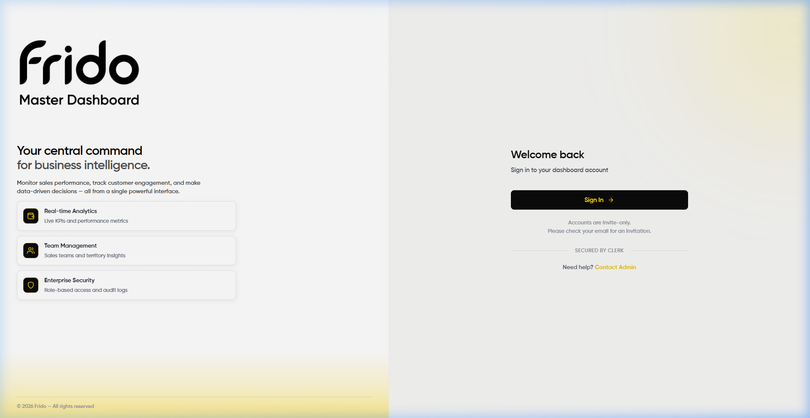
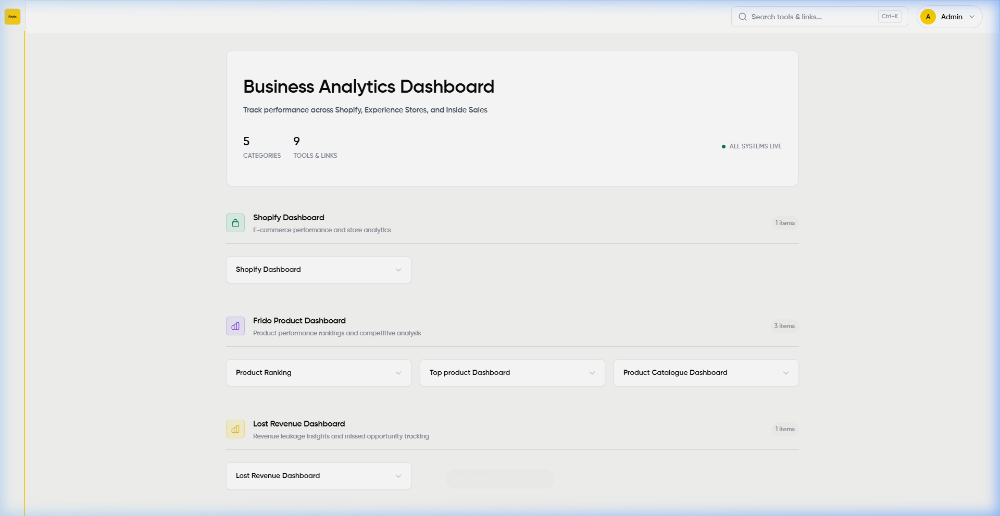
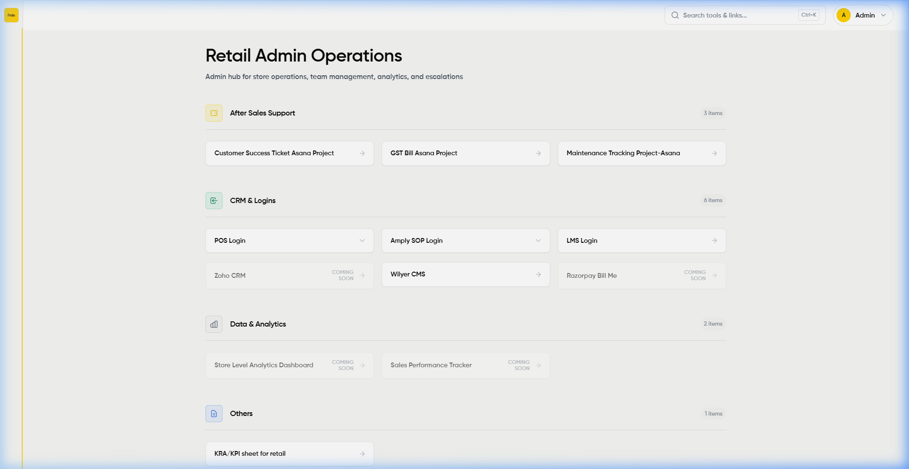
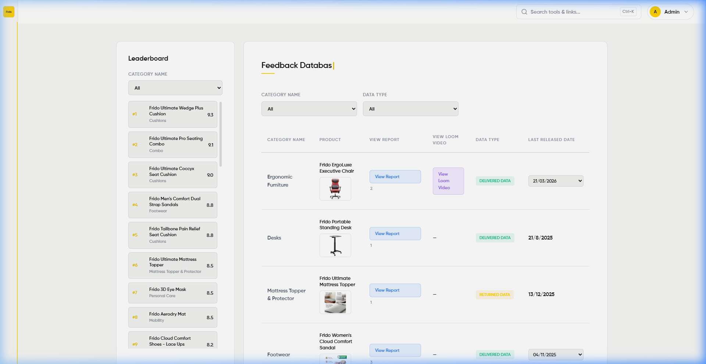

# Frido Master Dashboard

Internal dashboard for Frido: links to Shopify, stores, tooling, feedback, and a small admin area for users/notices.

---

## What it does

**Access** — Sign-in goes through Clerk. Invites decide who gets in; permissions split admin vs staff (see `src/config/permissions.js`).

Rough overview by area:

- **Analytics** — Quick links/metrics hooked to your Shopify (and related) workflows; specifics live in-app.
- **Retail / ops** — Store and admin shortcuts (CRM, after-sales, etc.) in one place.
- **Feedback** — Product feedback views and leaderboard-style summaries where configured.

---

## Stack


| Layer    | Choices                                               |
| -------- | ----------------------------------------------------- |
| Frontend | React 19, Vite, React Router 7                        |
| Auth     | Clerk                                                 |
| Styles   | Plain CSS (shared tokens / layout in `src/`)          |
| API      | Express 5                                             |
| Database | PostgreSQL via Supabase in production; SQLite locally |
| Email    | Microsoft Graph where invites/transactions need it    |

<p align="center">
  
</p>

---

## What it does

**Access** — Sign-in goes through Clerk. Invites decide who gets in; permissions split admin vs staff (see `src/config/permissions.js`).

<p align="center">
  
</p>

Rough overview by area:

- **Analytics** — Quick links/metrics hooked to your Shopify (and related) workflows; specifics live in-app.
- **Retail / ops** — Store and admin shortcuts (CRM, after-sales, etc.) in one place.

<p align="center">
  
</p>

- **Feedback** — Product feedback views and leaderboard-style summaries where configured.

<p align="center">
  
</p>

---

## Stack

| Layer        | Choices |
|-------------|---------|
| Frontend    | React 19, Vite, React Router 7 |
| Auth        | Clerk |
| Styles      | Plain CSS (shared tokens / layout in `src/`) |
| API         | Express 5 |
| Database    | PostgreSQL via Supabase in production; SQLite locally |
| Email       | Microsoft Graph where invites/transactions need it |

---

## Run it locally

You’ll need Node 18+ and npm.

```bash
git clone https://github.com/Ritaldojr7/Frido-Master-Dashboard.git
cd Frido-Master-Dashboard
npm install
cp .env.example .env
# fill Clerk keys and anything else from .env.example
npm run dev:all
```

Handy scripts:

- `npm run dev` — Vite only  
- `npm run dev:server` — API only  
- `npm run dev:all` — both  
- `npm run build` — production build
- `npm run build` — production build  

Production deploy details (Render, env vars, DB ping for Supabase) are in `.env.example` comments and hosting config—not duplicated here unless you ask.

**Continuous deployment** — On every push to `main`, the [CI workflow](.github/workflows/ci.yml) runs lint, tests, and a production build; when those succeed it POSTs to a Render [deploy hook](https://render.com/docs/deploy-hooks), so you can keep **auto-deploy off** in Render and still deploy from GitHub only. Add the repository secret `RENDER_DEPLOY_HOOK_URL` (the full hook URL from Render: **Dashboard → Web Service → Settings → Deploy Hooks**).

---

## Look & feel

Yellow accent (`#FFE100`), dark mode, and lightweight glass-style panels are intentional; tweaks are mostly in `src/App.css` and page CSS alongside components.

---

## License

© 2026 Frido. Proprietary—all rights reserved.
© 2026 Frido. Proprietary—all rights reserved.
